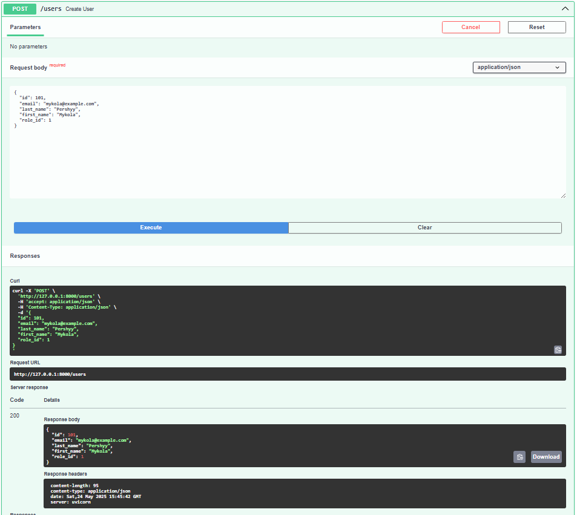

# Тестування працездатності системи
## Список доступних методів

## GET: список всіх користувачів

## POST: створюємо нового користувача

## PUT: змінемо дані користувача

## DELETE: видалимо користувача

